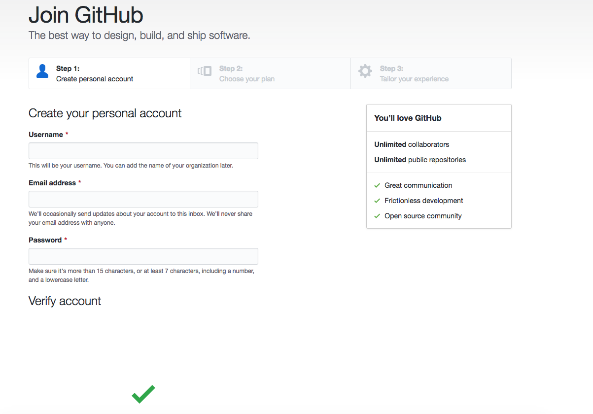

# GitHub Tutorial

_by Unaza Noor_

---
## Git vs. GitHub
#### Git
* Git is version control, meaning it keeps what we call "snapshots" of code
   * it keeps copies of your old code
* Git does not rquire github
* git runs in the commandline
* In git, you have a **directory** of files  

_"git is like a family photographer, it shows change over time"_ - Mr. Mueller  


Intitializing git: you only do it once in the beginning, we call an initialized git a repository  
Adding files to the staging area: getting the files ready to be committed, but not actually committing them 
Commiting your file is the part where you take the snapshot and save the code
**NEVER EVER** type Git init into your workspace*

#### Github
* _requires_ Git
* allows you to easily collaborate on projects
* stores code in the cloud
* Visually tracks changes
* also runs in the command line

---
## Initial Setup

### Making a github account

_if you already have a github account, skip this step_
1. To create a github account, go to the website and click sign up, or click [**_here_**](https://github.com/join?source=header-home)  
you should see this:  

2. follow the steps
3. Congrats you have an account!
### Setting up an SSH key
1. get your SSH code from your IDE 
2. go to github.com
3. go to the top-right and click the profile icon 
4. go to settings
5. go to the left sidebar and select SSH and GPG
6. create New SSH key
7. paste the ssh key you got from your ide. follow any instruction if applicable
8. go to your ide and open your repository
9. you should see:  
`Hi <username>! You've successfully authenticated, but GitHub does not provide shell access._`


---
## Repository Setup
To set up a repository, go to the directory you want, and type in, `git init`   
you now have a new repo!  
to add a file to the staging area, you can do one of three things,
1. git add <file-name> 
    * this will add that specific file to the staging area
2. git add .
    * this will add all files that have been changed. this Will not add any deleted or renamed files
3. git add --all
    * this will add all changes, including deleted and renamed files.
After adding a file to the staging area, you are going to commit it, to commit a file, type `git commit -m "(a short message to help you remember what you changed this commit. it should be present tense)`"  
You have your first commit!  
Now, you want to push this commit to your remote repository  
to do so, you can type in `git push -u origin master`, by typing this, you are letting git know that you always want to push to this repo.  
If you dont want to always push to one place, then you can type in `git remote add origin URL`   
This will push the commit to where you want it to go.

 

---
## Workflow & Commands
`git init` > initializes a repository  
`git diff` > See difference between current code and the previous commit  
`git log` > Shows your past commits > press Q to quit  
`git status` > Optional command to see which files have been edited since last commit (in red)
and to see which files are staged for the commit (in green)
`git remote -v`  > tells you where git push will send your commits to  
`git add . / git add --all / git add file` > adds files to staging area    
`git commit -m "message"`> Takes a ‘snapshot’ of the files on the stage.
---
## Rolling Back Changes
---
## Error Handling
*If you accidentally initialized git into your workspace:
```
username:~/workspace $ git init
```
 you'll be able to tell because now it looks like this:
```bash
username:~/workspace (master) $ 
```
notice that you are on the master branch, you shouldn't be,
but, dont worry, All you have to do is type this command :  

```bash 
rm-rf .git
```
and now you're back to normal.